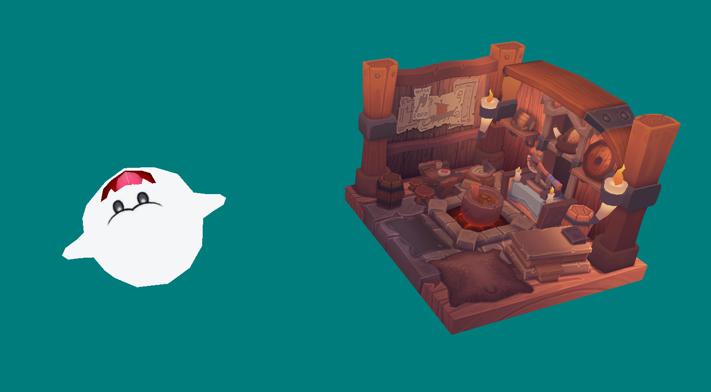

<h1 style = "color:cyan"> Vulkan Engine</h1>

<h2 style = "color:cyan"> Introduction <h2>

This project aim to to create a graphic engine using Vulkan  
We want to be able to setup and load Vulkan and also load obj's file with textures  
We also want to have a functional camera which will allow us to move friely in the scene  
Basically every aspect of vulkan setup was made using the vulkan tutorial online, i did everything until Model loading section

<h2 style = "color:cyan"> Architecture </h2>

The project is architectured using the base architecture given in the subject i just hadded the class Model and VulkanManager  
The class Model will aim to Load obj and texture and do everything linked to this. 
The class VulkanManager will load and handle everything about Vulkan.

<h2 style = "color:cyan"> Obj textures and Math</h2>

To parse the obj i use the tiny_obj_loader library which is a single file that allow us to parse and use an obj file  
To use the texture i use the stb_image library which is also a single file library  
For the math of the project i used the glm library  

<h2 style = "color:cyan"> Camera </h2>

The camera is also pretty simple, we calculate the projection matrix at the beginning of the application using glm::perspective  
The view matrix is created using the lookAt function from glm and we use the calculated vectors position , forward and up  
The up vector never change, the forward is calculated using the mouse movement and the pos is modified every time we press a key by multiplying the speed by the delta time and the forward vector  

<h2 style = "color:cyan"> Utilisation <h2>

<h3> Move </h3>
To move around inside the scene you just have to use WASD input to move, you can turn using the mouse  
To use the mouse you just have to maintain right click and move it  

<h3> The objects </h3>
All objects are loaded in the while vulkan is setting up and can't be moved for now  
Here is a screenshot of the scene with two objects loaded  
 

